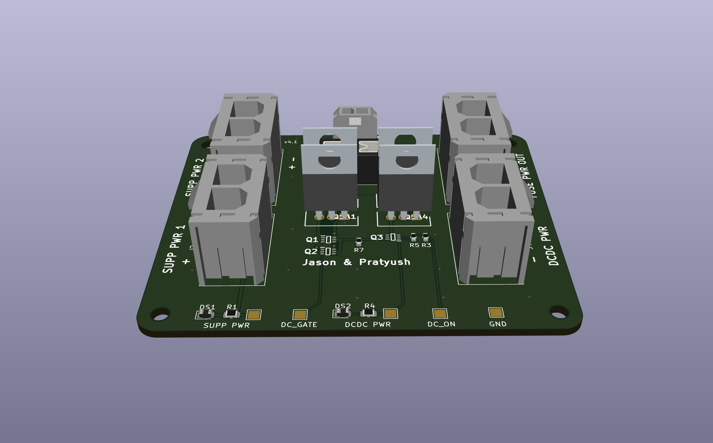

# Power-SecondaryPCB 
Author: Pratyush Patra and Jason Kacines

This board takes inputs from the DCDC converter and the Supplemental Battery and selects which source to output to the fuse box. DCDC is the power from the high voltage primary battery pack that gets stepped down to 12V through the DCDC converter. The supplemental battery pack is the low voltage 12V NiMH battery pack. When DCDC is on, the board will select DCDC, and when DCDC is off, the board will select the Supplemental Battery. The supplemental should only be selected during ignition and the fault state. The board selects the source using a 10V zener diode that will breakdown once DCDC is above 10V.

This board also interfaces with both the Supplemental Monitoring PCB and Ignition Switch:
- For the Supplemental Monitoring PCB, this board sends the voltage of the Supplemental Battery out from J1. 
- For the Ignition Switch, this board sends Supplemental Power to the Controls Board through J6, which is then routed back to this board through J7 when the Ignition Switch is changed from the off position. When this signal is sent to J7, it is routed to the gate of Q3 which turns on the NMOS and starts sending power to the fuse box.

## BOM
[**Interactive BOM (Must download and open in browser)**](bom/ibom.html)

[**Mouser Cart**](https://www.mouser.com/ProjectManager/ProjectDetail.aspx?AccessID=da938bf7b6)

## Connectors
| # | Name | Type | Ideal Voltage | Notes |
| - | - | - | - | - |
| J1  | SUPP PWR MON | 1x02_P3.00mm_Vertical Female | +12V | 9.9 mm tall |
| J2  | SUPP PWR 1 | 1x02_P7.49mm_Vertical Female |+12V | 14.76 mm tall |
| J3  | SUPP PWR 2 | 1x02_P7.49mm_Vertical Female | +12V | 14.76 mm tall |
| J4  | DCDC PWR | 1x02_P7.49mm_Vertical Female | +12V | 14.76 mm tall |
| J5  | FUSE OUT | 1x02_P7.49mm_Vertical Female | +12V | 14.76 mm tall |
| J6  | SUPP OUT | 1x02_P3.00mm_Vertical Female | +12V | 9.9 mm tall |
| J7  | LV ENABLE | 1x02_P3.00mm_Vertical Female | +12V | 9.9 mm tall |

## PCB

## Schematic

## Additional Notes
The tallest components are the Power MOSFETs(Q1A1, Q1A2, Q1A3, Q1A4) which are 18.5 mm tall and the connectors which are 14.76 mm tall.

## Current Board Concerns(8.26.2023)
If the two Supplemental Batteries are at different voltage, don't want to charge batteries.
If the two Supplemental Batteries are above 12V and DCDC is off, don't want to overvolt LV systems.
Will the SMD NMOS be able to hand the current?
Is the Zener diode selection ok?
Are the stitching vias ok?
Is the trace path ok at the top of the board(supp gate in particular)?