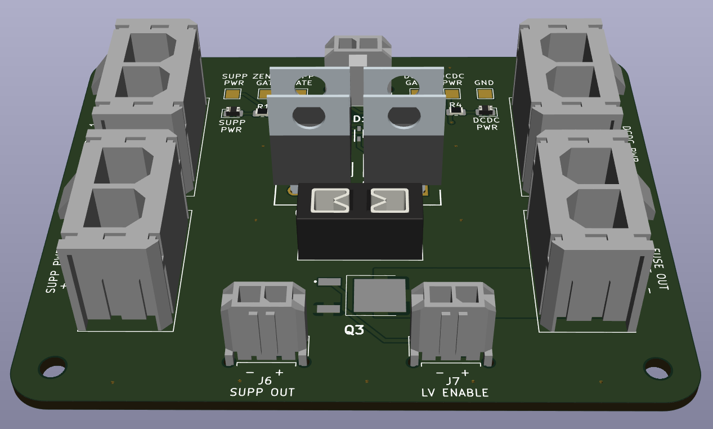

# Power-SecondaryPCB 
Author: Pratyush Patra

This board switches power to the fuse box between the DCDC power supply and the supplemental battery depending on whether the DCDC power is on.

## BOM
[**Interactive BOM (Must download and open in browser)**](bom/ibom.html)

[**Mouser Cart**](https://www.mouser.com/ProjectManager/ProjectDetail.aspx?AccessID=8ba7fa29c3)

## Connectors
| # | Name | Type | Ideal Voltage | Notes |
| - | - | - | - | - |
| J1  | SUPP PWR MON | 1x02_P3.00mm_Vertical Female | +12V | |
| J2  | SUPP PWR 1 | 1x02_P7.49mm_Vertical Female |+12V | 14.76 mm tall |
| J3  | SUPP PWR 2 | 1x02_P7.49mm_Vertical Female | +12V | 14.76 mm tall |
| J4  | DCDC PWR | 1x02_P7.49mm_Vertical Female | +12V | 14.76 mm tall |
| J5  | PWR OUT | 1x02_P7.49mm_Vertical Female | +12V | 14.76 mm tall |

## PCB

## Schematic

## Additional Notes
The tallest components are the Power MOSFETs(Q1A1, Q1A2, Q1A3, Q1A4) which are 18.5 mm tall and the connectors which are 14.76 mm tall.